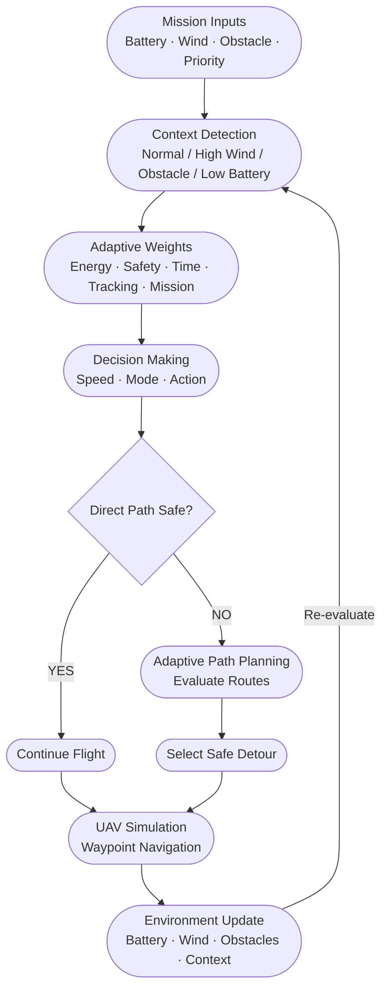
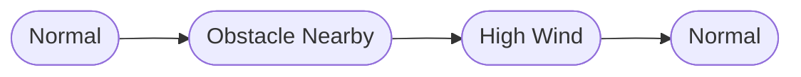
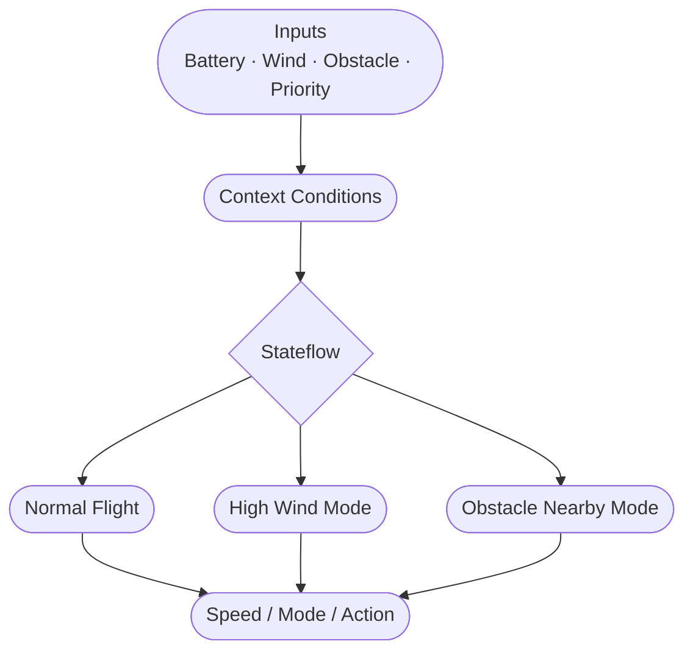

<h1> Adaptive Context-Aware Multi-Objective Flight Decision Algorithm</h1>

## Team Members

| S. No. | Name | Roll Number | Email |
|--------|------|-------------|-------|
| 1 | Deepika Reddy | cb.sc.u4aie24215 | [cb.sc.u4aie24215@cb.students.amrita.edu](mailto:cb.sc.u4aie24215@cb.students.amrita.edu) |
| 2 | Gade Varshini | cb.sc.u4aie24216 | [cb.sc.u4aie24216@cb.students.amrita.edu](mailto:cb.sc.u4aie24216@cb.students.amrita.edu) |
| 3 | Jovika N B | cb.sc.u4aie24223 | [cb.sc.u4aie24223@cb.students.amrita.edu](mailto:cb.sc.u4aie24223@cb.students.amrita.edu) |
| 4 | Poojitha P | cb.sc.u4aie24237 | [cb.sc.u4aie24237@cb.students.amrita.edu](mailto:cb.sc.u4aie24237@cb.students.amrita.edu) |
| 5 | Potnuru Varun | cb.sc.u4aie24244 | [cb.sc.u4aie24244@cb.students.amrita.edu](mailto:cb.sc.u4aie24244@cb.students.amrita.edu) |

## Abstract

This project proposes an Adaptive Contextual Multi-Factor Decision System (ACMFDS) for autonomous UAV navigation in dynamic environments. The system continuously evaluates battery level, wind conditions, obstacle distance, mission priority, safety, energy, time, and tracking requirements to determine appropriate flight behavior. Based on the changing context, it dynamically adjusts decision weights, flight speed, operating mode, and navigation strategy. When obstacles block the direct path, an adaptive path planner evaluates alternative routes based on distance, clearance, and cost, while unsafe routes are rejected. The system also responds to environmental changes such as nearby obstacles and high wind by switching to appropriate safety-oriented modes and replanning the mission. A simulation demonstrates successful context detection, adaptive decision-making, obstacle avoidance, dynamic path planning, waypoint navigation, and mission completion while maintaining energy efficiency and safety. Thus, ACMFDS provides a unified framework for intelligent, context-aware, and adaptive UAV mission planning and autonomous navigation.

## Introduction

ACMFDS (Adaptive Contextual Multi-Factor Decision System) is a MATLAB/Simulink-based framework for autonomous UAV navigation in dynamic environments. It considers battery level, wind speed, obstacle distance, and mission priority to identify the current context and adapt the UAV's speed, flight mode, and navigation action. The system uses five factors—Energy, Safety, Time, Tracking, and Mission—with context-dependent weights to make balanced decisions.

The overall decision cost is represented as:

$$C = \sum_i w_i f_i$$

| Symbol | Description |
|--------|-------------|
| **C** | Overall decision / path cost |
| **w_i** | Importance (weight) of each factor |
| **f_i** | Value / cost of that factor |

When the direct path is blocked, the planner evaluates alternative routes using distance, clearance, and cost, rejects unsafe routes, and selects a feasible detour.

The project integrates **MATLAB**, **Simulink**, and **Stateflow** to demonstrate context detection, adaptive decision-making, obstacle avoidance, dynamic path planning, waypoint navigation, changing environmental conditions, and successful mission completion.

## Methodology

### 1.Overall Methodology

The proposed Adaptive Contextual Multi-Factor Decision System (ACMFDS) follows a closed-loop decision-making process. The UAV receives environmental and mission information such as battery level, wind speed, obstacle distance, and mission priority. These inputs are used to determine the current operating context.

Based on the detected context, ACMFDS selects appropriate decision weights, flight speed, operating mode, and action. If the direct path is safe, the UAV continues toward the waypoint. If an obstacle blocks the path, the adaptive planner evaluates possible detours based on distance, safety clearance, and cost. The selected path is then used by the UAV simulation, while changing environmental conditions can trigger a new decision.

### 2.Methodology Flow Diagram

### 3.Input and Environment Modeling

The system uses four main environmental/mission inputs:

| Input | Purpose |
|-------|---------|
| Battery Level | Represents the available UAV energy |
| Wind Speed | Represents environmental disturbance |
| Obstacle Distance | Determines the level of navigation risk |
| Mission Priority | Represents the importance of completing the mission |

These values can be changed during simulation to demonstrate how the UAV responds to different operating conditions.

### 4.Context Detection

The input conditions are interpreted by the decision system to determine the UAV's current context. Typical contexts used in the project include:

- **Normal** – Suitable environmental conditions.
- **Obstacle Nearby** – An obstacle requires increased safety consideration.
- **High Wind** – Strong wind requires safer flight behavior.
- **Low Battery** – Energy conservation becomes important.

The detected context determines which decision strategy and weights should be applied.

### 5.Adaptive Multi-Factor Decision Making

#### 5.1 Decision Factors

ACMFDS considers five major decision factors:

| Factor | Description |
|--------|-------------|
| **Energy** | Reduces unnecessary energy consumption |
| **Safety** | Prioritizes safe operation and obstacle clearance |
| **Time** | Considers the time required to complete the route |
| **Tracking** | Encourages the UAV to remain close to the desired route |
| **Mission** | Considers the importance of mission completion |

#### 5.2 Decision Cost Formula

The combined decision cost is represented as:

$$C = \sum_{i=1}^{n} w_i f_i$$

For this project, the expanded form is:

$$C = w_E E + w_S S + w_T T + w_R R + w_M M$$

| Symbol | Description |
|--------|-------------|
| **C** | Overall decision cost |
| **E** | Energy cost |
| **S** | Safety cost |
| **T** | Time cost |
| **R** | Tracking cost |
| **M** | Mission cost |
| **w_E, w_S, w_T, w_R, w_M** | Corresponding adaptive weights |

#### 5.3 Context-Dependent Weights

Not every factor is equally important in every situation. The weights are adapted based on the current context rather than remaining fixed:

| Context | Priority |
|---------|----------|
| **Normal** | Efficiency and mission progress receive more consideration |
| **Obstacle Nearby** | Safety receives greater importance |
| **High Wind** | Safe operation becomes more important than minimizing travel time |

### 6 Adaptive Path Planning

After the decision stage, the system checks whether the direct path to the next waypoint is safe.

#### 6.1 Case 1 — Direct Path is Clear

The UAV follows the direct path toward the waypoint without any replanning.

#### 6.2 Case 2 — Direct Path is Blocked

The planner generates alternative routes in the following directions:

| Direction | Description |
|-----------|-------------|
| **East** | Alternative route to the east |
| **West** | Alternative route to the west |
| **North** | Alternative route to the north |
| **South** | Alternative route to the south |

Each candidate route is evaluated using its distance, obstacle clearance, and associated cost.

#### 6.3 Path Cost Formula

A simplified path-cost representation is:

$$C_{path} = w_d D + w_s S + w_t T$$

| Symbol | Description |
|--------|-------------|
| **D** | Path distance |
| **S** | Safety / clearance cost |
| **T** | Travel-time cost |
| **w_d, w_s, w_t** | Corresponding importance weights |

#### 6.4 Route Selection

- Routes that do not satisfy the required safety clearance are considered **infeasible** and are **rejected**.
- The UAV selects the **lowest-cost feasible route** among the remaining candidates.

### 7.Obstacle Clearance and Safety

The system does not consider the UAV as a point. A vehicle radius and safety buffer are included when determining whether a route is safe.

The required clearance is represented as:

$$d_{required} = r_{UAV} + b_{safety}$$

| Symbol | Description |
|--------|-------------|
| **d_required** | Minimum required clearance distance |
| **r_UAV** | UAV / vehicle radius |
| **b_safety** | Additional safety buffer |

A candidate path is rejected when it enters the unsafe region around an obstacle. This allows the simulation to demonstrate realistic obstacle avoidance rather than simply checking whether the UAV's center crosses the obstacle.

### 8.Dynamic Context Update

One of the main features of ACMFDS is that the environment can change during the mission, and the system continuously re-evaluates its decisions accordingly.

#### Context Transition Example

#### What Gets Updated on Context Change?

| Parameter | Description |
|-----------|-------------|
| **Flight Mode** | Switches between Normal, Safety, and Emergency modes |
| **UAV Speed** | Adjusted based on current risk level |
| **Decision Weights** | Re-prioritized according to the new context |
| **Navigation Action** | Flight behavior is updated accordingly |
| **Selected Path** | A new safe route is planned if required |

> **Key Principle:** The UAV does not need to complete the entire mission using the original decision. It continuously re-evaluates its behavior as conditions change, ensuring safe and efficient mission completion at all times.

### 9.Stateflow Implementation

The Stateflow component represents the UAV's behavioral logic. The input conditions are supplied to the Stateflow model, where transitions determine the appropriate operating state.

#### State Transition Flow

#### Operating States

| State | Trigger Condition | UAV Behavior |
|-------|------------------|--------------|
| **Normal Flight** | Stable environment, clear path | Standard speed, efficiency-focused |
| **High Wind Mode** | Wind speed exceeds threshold | Reduced speed, safety-prioritized |
| **Obstacle Nearby** | Obstacle within safety distance | Replanning triggered, safety weight increased |

> **Key Principle:** Each state transition is driven by the input conditions, ensuring the UAV always operates in the most appropriate mode for the current environment.
